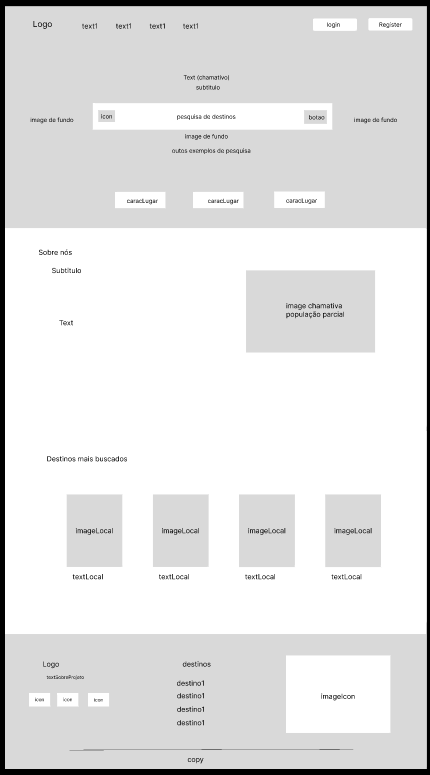

# Project Papo de Viagem 
Repositório para realização do PI, consiste em um sistema de Agencia de viagens construido utilizando HTML, CSS, JavaScript e JAVA 

logo da agencia no canto superior esquerdo em todas as telas

1°  tela: dashboard

Header: logo da agencia no canto esquerdo, canto direito botao de login 
body : buscador de viagens com filtro de qualidade, ordem alfabetica, destino da viagem, opcão de ida e volta e quantidade de pessoas 
propagandas com viagens em alta com preços, imagem do local e nome, (se possivel um carrossel com algumas viagens)  

2°  tela: login

logo da agencia acima da caixa de login
caixa de texto para inserir email e senha, 3 botes (login, registrar e voltar)

3°  tela: registro

logo da agencia acima da caixa de registro
caixa de texto para inserir nome,data de nascimento, email e senha e cpf, 3 botes (login, registrar e voltar)

4°  tela: Viagens

varias seçoes com todas as viagens para visualização/ caso seja Administrador podera cancelar ou editar 

5°  tela: compra

um breve resumo da viagem escolhida pelo usuario, possibilidade de escolha para forma de pagamento, e botão de concluir compra.

6°  tela: detalhes de viagem

exibe detalhes da viagem como: local, data, descrição e preço/ caso seja Administrador podera cancelar ou editar 

7°  tela: suas viagens

exibe todas as viagens adquiridas pelo cliente

8°  tela: gerenciamento de Perfil

editar informações do usuario logado

Prototipagem:

